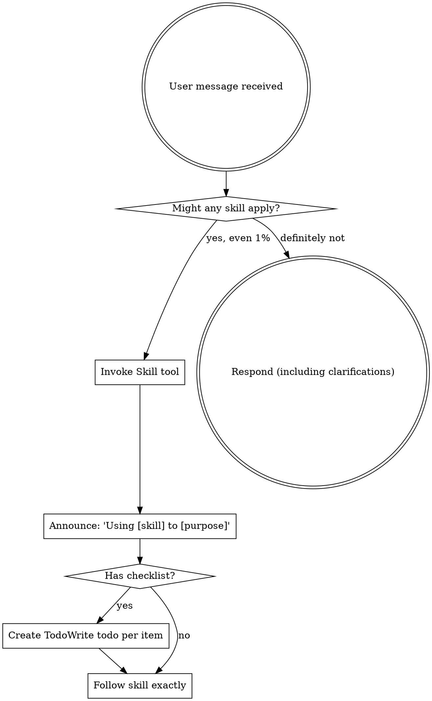

<EXTREMELY-IMPORTANT>
If you think there is even a 1% chance a skill might apply to what you are doing, you ABSOLUTELY MUST invoke the skill.

IF A SKILL APPLIES TO YOUR TASK, YOU DO NOT HAVE A CHOICE. YOU MUST USE IT.

This is not negotiable. This is not optional. You cannot rationalize your way out of this.
</EXTREMELY-IMPORTANT>

## How to Access Skills

**In Claude Code:** Use the `Skill` tool. When you invoke a skill, its content is loaded and presented to you—follow it directly. Never use the Read tool on skill files.

**In other environments:** Check your platform's documentation for how skills are loaded.

# Using Skills

## The Rule

**Invoke relevant or requested skills BEFORE any response or action.** Even a 1% chance a skill might apply means that you should invoke the skill to check. If an invoked skill turns out to be wrong for the situation, you don't need to use it.

## Red Flags

These thoughts mean STOP—you're rationalizing:

| Thought | Reality |
|---------|---------|
| "This is just a simple question" | Questions are tasks. Check for skills. |
| "I need more context first" | Skill check comes BEFORE clarifying questions. |
| "Let me explore the codebase first" | Skills tell you HOW to explore. Check first. |
| "I can check git/files quickly" | Files lack conversation context. Check for skills. |
| "Let me gather information first" | Skills tell you HOW to gather information. |
| "This doesn't need a formal skill" | If a skill exists, use it. |
| "I remember this skill" | Skills evolve. Read current version. |
| "This doesn't count as a task" | Action = task. Check for skills. |
| "The skill is overkill" | Simple things become complex. Use it. |
| "I'll just do this one thing first" | Check BEFORE doing anything. |
| "This feels productive" | Undisciplined action wastes time. Skills prevent this. |
| "I know what that means" | Knowing the concept ≠ using the skill. Invoke it. |

## Workflow Routing (The Superpowers Logic)

When a task begins, you MUST map the user's intent to the appropriate skill following this priority:

1.  **Requirement Clarification & Design**: Use `brainstorming` when intent is vague or needs architectural design.
2.  **Requirement Consolidation**: Use `requirement-crystallization` after brainstorming to finalize requirements before planning.
3.  **Implementation Planning**: Use `writing-plans` as soon as the design is crystallized. This is MANDATORY before any code changes.
3.  **Isolated Execution**: Use `using-git-worktrees` if the project size or risk warrants isolation.
4.  **Test-Driven Implementation**: Use `test-driven-development` for all code changes.
5.  **Debugging**: Use `systematic-debugging` if the task involves fixing a bug or investigating a failure.
6.  **Review & Completion**:
    *   Use `requesting-code-review` before finishing a task.
    *   Use `verification-before-completion` to prove work is done.
    *   Use `finishing-a-development-branch` to integrate work.

## Integration with CodeBuddy Task Tool

When invoking a subagent via the `Task` tool:
- You MUST explicitly tell the subagent which skill it is implementing.
- Pass the relevant section of the skill's instructions in the `prompt` parameter.

## Evidence over Claims

Never state that a task is finished without providing evidence (test results, linter output, or verification steps).

## Skill Types

**Rigid** (TDD, debugging): Follow exactly. Don't adapt away discipline.

**Flexible** (patterns): Adapt principles to context.

The skill itself tells you which.

## User Instructions

Instructions say WHAT, not HOW. "Add X" or "Fix Y" doesn't mean skip workflows.
